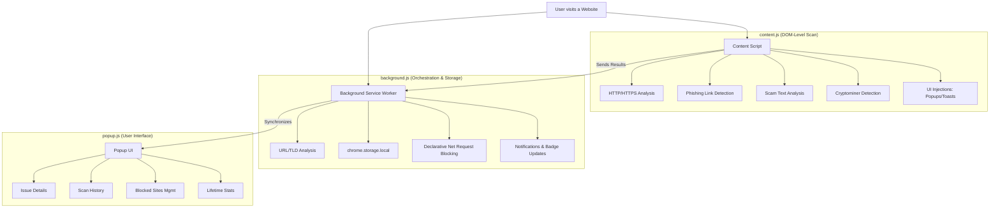

# 🛡️ AI Cyber Defense Shield — Extension Architecture & Logic

This document provides a technical overview of how the **AI Cyber Defense Shield** standalone extension operates. 

## 1. High-Level Architecture

The extension is built using **Chrome Extension Manifest V3 (MV3)** and is designed to be completely standalone, requiring no backend or external API. All scanning logic, data storage, and threat mitigation happen locally within the user's browser.

---

## 2. Scanning Engine Logic

The extension employs a multi-layered scanning approach to identify threats.

### A. Immediate Page-Level Checks (Pre-Render)
Executed as soon as the page begins loading (`document_idle` in `manifest.json`):
- **HTTP Enforcement:** Alerts if a site is not using HTTPS.
- **Sensitive Fields on HTTP:** specifically looks for `<input type="password">` or payment-related fields (credit card, CVV) on unencrypted pages.
- **Phishing Domain Regex:** Scans the hostname for common homographs and typosquatting patterns (e.g., `paypa1`, `amaz0n`, `g00gle`).
- **Cryptominer Detection:** Scans `<script>` tags for known cryptomining signatures (e.g., Coinhive).
- **Clickjacking Protection:** Detects if the page is being loaded inside an iframe.

### B. Deep Page Scan (Post-Render)
Executed 800ms after load to account for dynamic content:
- **Phishing Link Scanner:** 
    - Analyzes every `<a>` tag's `href`.
    - Checks for high-risk TLDs (`.tk`, `.ml`, `.ga`, `.zip`, etc.).
    - Detects **mismatched links** (e.g., link text says "paypal.com" but the `href` goes elsewhere).
    - Flags `javascript:` links.
- **Scam Content Analysis:** Uses regex to find social engineering patterns in the text (e.g., "account suspended", "verify urgently", "you won a prize").
- **Privacy Tracker Detection:** Identifies tracking pixels (1x1 images) and known beacon scripts, automatically hiding them.

---

## 3. Threat Mitigation & UI

### In-Page UI (content.js)
- **Risk Popup:** A sliding panel from the top-right showing the overall risk score (0-100) and specific issues.
- **Threat Masking:** 
    - **Phishing Links:** Replaced with a "🛡️ Phishing Link Blocked" placeholder.
    - **Scam Text:** Highlighted with a warning tooltip.
    - **Trackers:** Hidden via `display: none`.
- **Scan Toast:** A small notification at the bottom indicating how many threats were masked on the page.

### Global UI
- **Dynamic Badge:** The extension icon displays a colored badge (Green ✓, Yellow !, Orange !!, Red ✕) based on the current site's risk.
- **System Notifications:** High-risk or Critical threats trigger a native Chrome OS notification.

---

## 4. Security & Data Privacy

### Local Storage
All data is stored using `chrome.storage.local`. 
- **Scan History:** Keeps track of the last 500 domains scanned and their results.
- **Blocked Sites:** A user-managed list of domains to block.
- **Statistics:** Anonymous lifetime counters for scans, threats, and blocks.

### Network-Level Blocking (Declarative Net Request)
When a user (or the AI) decides to **Block a Site**, the extension uses the `chrome.declarativeNetRequest` API. This creates dynamic firewall rules that block the domain at the network level, preventing any data from being sent or received from that site in the future.

---

## 5. Technical Specification Summary

| Component | Technology | Primary Responsibility |
| :--- | :--- | :--- |
| **Manifest** | MV3 | Permissions (`storage`, `tabs`, `dnr`) and structure. |
| **Content Script** | JS, CSS | DOM manipulation, UI injection, real-time page scanning. |
| **Service Worker** | JS | Storage management, badge updates, URL-level analysis, background sync. |
| **Popup** | HTML, JS, CSS | User dashboard, history viewing, site management. |
| **Blocking Engine** | DNR API | High-performance network-level filtering. |
